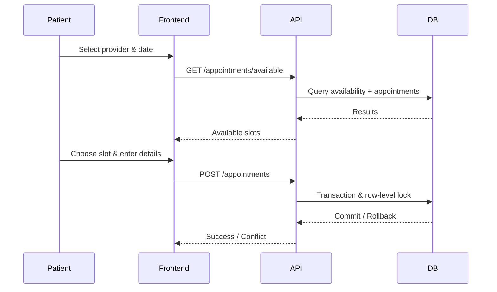

# System Architecture

This document provides a high-level overview of the CareSync architecture.

## Components

1. **Client (React)**
   - Communicates with the backend via REST over HTTPS.
   - Handles provider and patient workflows.

2. **Backend (Express)**
   - Exposes RESTful API endpoints under `/api`.
   - Contains business logic, validation and timezone handling.

3. **Database (PostgreSQL)**
   - Stores providers, availability blocks and appointments.
   - Enforces data integrity through foreign keys, unique constraints and transactions.

## Flow Diagram

## Deployment

- **Docker Compose** launches the API, database and frontend in a single network.
- Environment variables are stored in `.env` files and injected at runtime.
