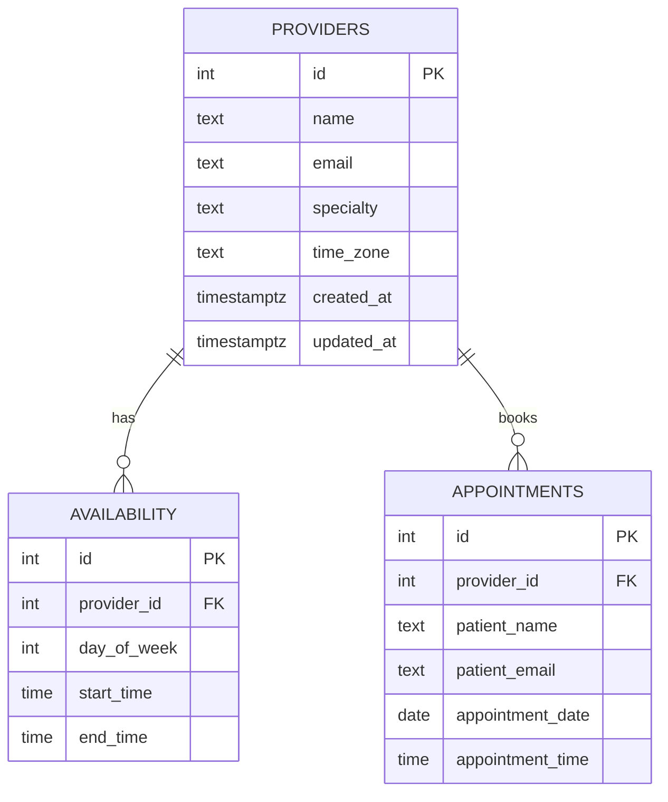

# Database Schema & Migrations

## Entity Relationship Diagram


```mermaid
erDiagram
  PROVIDERS ||--o{ AVAILABILITY : has
  PROVIDERS ||--o{ APPOINTMENTS : books
  PROVIDERS {
    int id PK
    text name
    text email
    text specialty
    text time_zone
    timestamptz created_at
    timestamptz updated_at
  }
  AVAILABILITY {
    int id PK
    int provider_id FK
    int day_of_week
    time start_time
    time end_time
  }
  APPOINTMENTS {
    int id PK
    int provider_id FK
    text patient_name
    text patient_email
    date appointment_date
    time appointment_time
  }
```

## Migrations

Migrations are plain SQL files inside `server/migrations`. Apply them with:

```bash
npm run migrate
```
